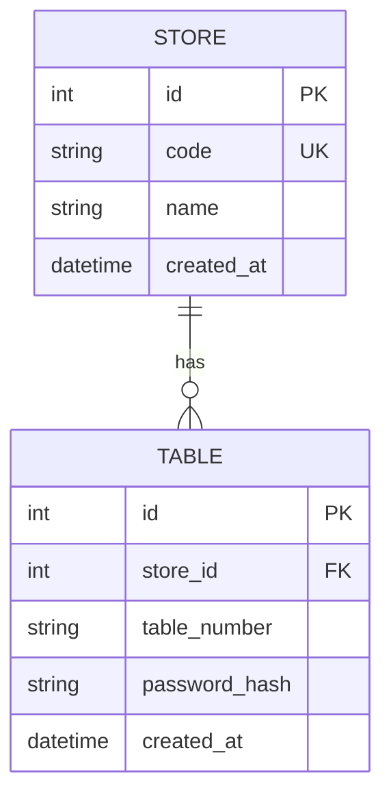

# U0 도메인 엔티티 (Domain Entities)

U0가 **소유**하는 엔티티는 `Store`, `Table`. 나머지 엔티티(AdminUser, Menu, Order, Session, OrderHistory)는 각 도메인 유닛이 소유하되, 모두 U0의 `Base`를 상속하고 `store_id`로 격리된다.

## Store (매장)
멀티테넌트의 최상위 격리 단위.

| 필드 | 타입 | 제약 | 설명 |
|---|---|---|---|
| id | int | PK, autoincrement | 내부 식별자 |
| code | str | unique, not null, index | **매장 식별자** — 관리자/테이블 로그인 시 입력하는 값 |
| name | str | not null | 매장 표시명 |
| created_at | datetime | not null, default now | 생성 시각 |

- 관계: `tables` 1:N `Table`.

## Table (테이블)
매장 내 테이블(태블릿). 고객 세션의 물리적 단위.

| 필드 | 타입 | 제약 | 설명 |
|---|---|---|---|
| id | int | PK, autoincrement | 내부 식별자 |
| store_id | int | FK→store.id, not null, index | 소속 매장(격리 키) |
| table_number | str | not null | 매장 내 테이블 번호(표시) |
| password_hash | str | not null | 테이블 비밀번호(bcrypt 해시) — 태블릿 설정/자동 로그인용(US-A4/C1) |
| created_at | datetime | not null, default now | |

- 제약: `unique(store_id, table_number)`.
- 관계: `store` N:1 `Store`.
- 비밀번호 해싱은 Auth(U1)가 수행하지만, 엔티티/필드는 U0 소유.

## 공통 Base
- `Base = declarative_base()` — 모든 유닛의 모델이 상속.
- 규약: store 격리가 필요한 모든 테이블은 `store_id: int (FK→store.id, index)` 컬럼을 갖는다(NFR-3). `Store` 자신은 예외.

## StoreContext (요청 스코프 인증 컨텍스트) — 계약 E
엔티티가 아닌 요청 스코프 값 객체. 모든 라우터가 의존성으로 주입받는다.

| 필드 | 타입 | 설명 |
|---|---|---|
| store_id | int | 현재 요청의 매장(격리 키) |
| role | str | `"admin"` \| `"table"` |
| subject | str | 관리자 username 또는 테이블 식별 |
| table_id | int \| None | role=table일 때 테이블 id |

- 토큰 검증은 Auth(U1)가 수행해 이 객체를 채운다. U0는 **구조 + 주입 의존성 + 검증자 등록 인터페이스**를 소유.

## ER (요약)

