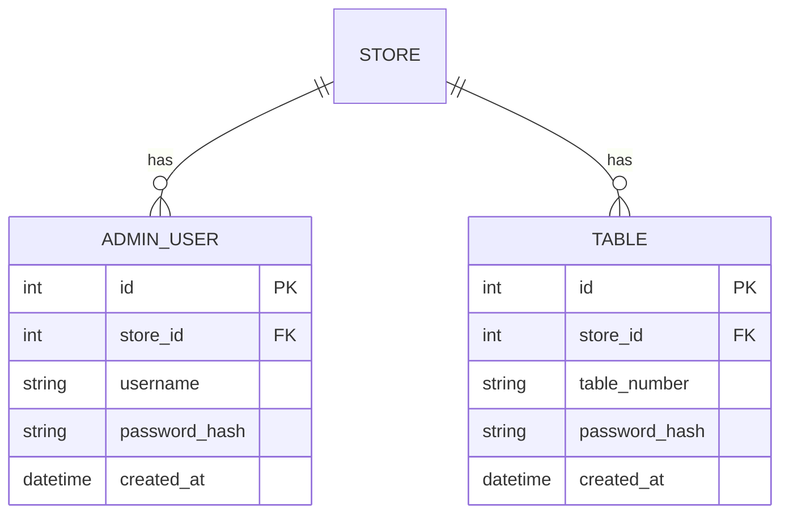

# U1 Auth — 도메인 엔티티 (Domain Entities)

U1이 **신규 소유**하는 엔티티는 `AdminUser`. `Store`·`Table`은 **U0 소유**이며 U1은 이를 참조/기록(테이블 비밀번호·번호)한다. 로그인 시도 추적은 **인메모리**(Q2=A)이므로 DB 엔티티가 아니다.

## AdminUser (매장 관리자 계정) — U1 소유
매장별 관리자 로그인 계정. `Base` 상속, `store_id`로 격리(NFR-3).

| 필드 | 타입 | 제약 | 설명 |
|---|---|---|---|
| id | int | PK, autoincrement | 내부 식별자 |
| store_id | int | FK→store.id, not null, index | 소속 매장(격리 키) |
| username | str | not null | 관리자 로그인 아이디 |
| password_hash | str | not null | bcrypt 해시(U0 `security.hash_password`) |
| created_at | datetime | not null, default now | 생성 시각 |

- 제약: `unique(store_id, username)` — 같은 매장 내 아이디 중복 금지.
- 관계: `store` N:1 `Store`.
- 프로비저닝(Q1=A): **시드 스크립트로만 생성**(매장당 최소 1개). 관리자 계정 CRUD UI/API는 U1 범위 밖(MVP).

## Table (테이블) — U0 소유 · U1이 설정 기록 (Q5=B)
U0가 소유하는 엔티티(`store_id`, `table_number`, `password_hash`, `created_at`). U1은 US-A4에서 다음을 수행한다:
- 신규 테이블 **생성**(번호 지정 + 비밀번호 해시 저장).
- 기존 테이블 번호/비밀번호 **수정**.
- 제약(U0 정의): `unique(store_id, table_number)` — U1의 생성/수정 시 준수.
- `password_hash`는 U0 `security.hash_password`로 해싱해 저장(평문 미저장, BR-U1-9).

> U1은 `Table` 스키마를 변경하지 않는다. U0 계약 필드만 사용한다.

## StoreContext (요청 스코프) — 계약 E · U0 구조 / U1 채움
U0 `common/security.StoreContext(store_id, role, subject, table_id)`. U1의 `TokenVerifier`가 토큰을 검증해 이 값 객체를 생성한다.

| role | subject | table_id | 발급 출처 |
|---|---|---|---|
| `"admin"` | AdminUser.username | None | 관리자 로그인(US-A1) |
| `"table"` | `"table:{table_id}"` | Table.id | 테이블 로그인(US-C1) |

## 인메모리 시도 추적 (Q2=A · 엔티티 아님)
프로세스 메모리 딕셔너리. 키=`(store_id, username)`, 값=`{failed_count:int, locked_until:datetime|None}`.
- 서버 재시작 시 초기화(로컬/워크숍 허용).
- 관리자 로그인에만 적용(Q4=A).
- 상세 규칙은 `business-rules.md`(BR-U1-3~5), 흐름은 `business-logic-model.md`.

## ER (요약)

> `TABLE`은 U0 소유 엔티티(참조용 표시). `ADMIN_USER`만 U1 신규 소유.
