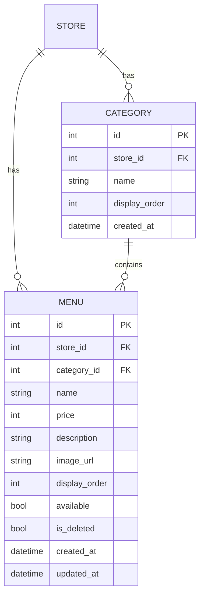

# U2 Menu 도메인 엔티티 (Domain Entities)

U2가 **소유**하는 엔티티는 `Category`, `Menu`. 둘 다 U0 `Base`를 상속하고 `store_id`로 격리된다(NFR-3, BR-U0-1). 결정 근거: Q1:A(별도 Category 엔티티), Q3:B(소프트 삭제), Q4:A(품절 토글), Q5:B(카테고리·메뉴 모두 순서 관리), Q6:B(정수 KRW), Q7:B(이미지 URL 검증).

---

## Category (카테고리)
메뉴 분류 단위. 매장별로 독립. 관리자가 명시적으로 CRUD·순서 관리(Q2:A).

| 필드 | 타입 | 제약 | 설명 |
|---|---|---|---|
| id | int | PK, autoincrement | 내부 식별자 |
| store_id | int | FK→store.id, not null, index | 소속 매장(격리 키) |
| name | str | not null | 카테고리명(표시) |
| display_order | int | not null, default 0 | 매장 내 카테고리 노출 순서(오름차순) |
| created_at | datetime | not null, default now | 생성 시각 |

- 제약: `unique(store_id, name)` — 매장 내 카테고리명 중복 금지(BR-U2-9).
- 관계: `menus` 1:N `Menu`.
- 삭제: **하드 삭제**이되 활성(미삭제) 메뉴가 남아있으면 금지(BR-U2-8).

## Menu (메뉴)
개별 메뉴 항목. 항상 하나의 Category에 속한다.

| 필드 | 타입 | 제약 | 설명 |
|---|---|---|---|
| id | int | PK, autoincrement | 내부 식별자 |
| store_id | int | FK→store.id, not null, index | 소속 매장(격리 키) |
| category_id | int | FK→category.id, not null, index | 소속 카테고리 |
| name | str | not null | 메뉴명 |
| price | int | not null | 가격(원, KRW). 0 이상, 소수점 없음(Q6:B) |
| description | str \| None | nullable | 메뉴 설명(선택, Q7:B) |
| image_url | str \| None | nullable | 이미지 URL(선택, http(s) 형식 검증, Q7:B) |
| display_order | int | not null, default 0 | 카테고리 내 노출 순서(오름차순) |
| available | bool | not null, default true | 판매 가능 여부(품절 토글, Q4:A). false=품절 |
| is_deleted | bool | not null, default false | 소프트 삭제 플래그(Q3:B). true=숨김 |
| created_at | datetime | not null, default now | 생성 시각 |
| updated_at | datetime | not null, default now, onupdate now | 수정 시각 |

- 인덱스: `(store_id, category_id, display_order)` — 고객 조회 정렬 최적화.
- 관계: `category` N:1 `Category`, `store` N:1 `Store`.
- 상태 조합:
  - **정상 판매**: `is_deleted=false, available=true` — 고객에게 표시 + 주문 가능.
  - **품절**: `is_deleted=false, available=false` — 고객에게 표시(품절 배지) + 주문 불가.
  - **삭제**: `is_deleted=true` — 고객 조회·계약 A에서 완전 제외(available 값 무관).

> `is_deleted`(완전 숨김)와 `available`(표시하되 주문 불가)은 **별개 상태**다.

---

## 상태 값 상수
- 주문 상태 등은 U3 소유. U2는 `available`/`is_deleted` 불리언만 관리(별도 enum 없음).

## ER (요약)

> `Category`/`Menu`는 U0 `Base` 상속. `store_id`는 `StoreContext.store_id`(계약 E)에서만 파생하며 클라이언트 입력을 신뢰하지 않는다(BR-U0-3).
