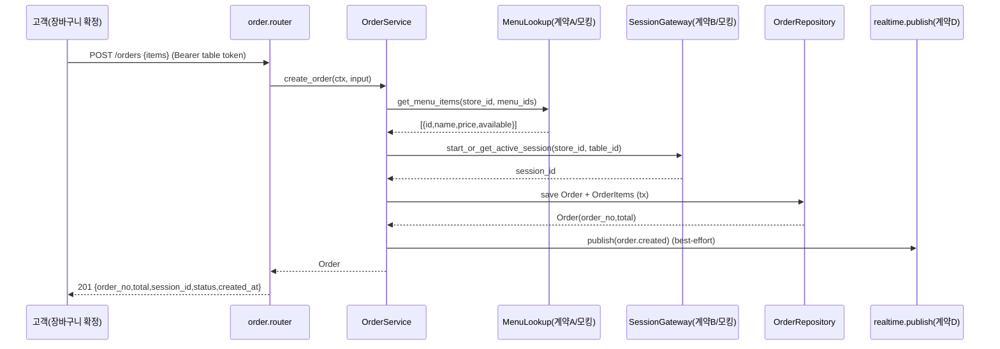

# U3 비즈니스 로직 모델 (Business Logic Model) — Order (+ Cart)

기술 중립적 비즈니스 로직. 계층: `router → OrderService → OrderRepository`(Q5-A 3계층). 타 유닛 의존은 계약(A/B/C/D)에 대한 **인터페이스 + 모킹**으로 병렬 개발한다.

## 의존 계약 인터페이스 (U3가 소비/제공)

| 계약 | 방향 | 인터페이스(U3 관점) | 병렬 개발 |
|---|---|---|---|
| A. Menu 조회 | U3→U2 | `MenuLookup.get_menu_items(store_id, menu_ids) -> [{id, name, price, available}]` | Protocol + 스텁 모킹 |
| B. Session | U3→U4 | `SessionGateway.start_or_get_active_session(store_id, table_id) -> session_id`; `get_active_session(store_id, table_id) -> session_id?` | Protocol + 스텁 모킹 |
| D. Realtime publish | U3→U4 | U0 `realtime.publish(store_id, event)` + `events.py` 팩토리 | U0 제공(NoOp 기본) |
| C. 이력 이관(제공) | U4→U3 | `collect_active_session_orders(store_id, session_id) -> [OrderSnapshot]`; `mark_orders_archived(store_id, order_ids)` | U3가 구현·노출 |

> A/B는 U3 내부에 `Protocol`로 정의하고, 통합 시 실제 U2/U4 구현을 주입(의존성 주입). 단위 테스트는 모킹으로 진행.

---

## OrderService 메서드 로직

### 1. `create_order(ctx, OrderInput) -> Order` (US-C4)
**입력**: `ctx`(role=table, store_id, table_id), `OrderInput{items:[{menu_id, qty}]}`.

1. **검증**: `items` 비어있지 않음(BR-U3-1), 각 `qty > 0`(BR-U3-2). 위반 시 `ValidationError`.
2. **메뉴 검증·단가 조회(계약 A)**: `get_menu_items(store_id, [menu_id...])`. 요청 메뉴가 모두 존재하고 `available=true`인지 확인(BR-U3-3). 누락/미노출 메뉴 → `ValidationError`.
3. **세션 확보(계약 B)**: `start_or_get_active_session(store_id, table_id) -> session_id`. 첫 주문이면 U4가 새 세션 시작, 아니면 활성 세션 재사용(BR-U3-4).
4. **금액 계산**: 각 라인 `line_total = unit_price(스냅샷) × qty`, `total = Σ line_total`(BR-U3-5). 서버 계산값만 사용.
5. **번호 채번**: `order_no` = 매장별 다음 일련번호(BR-U3-6, `max(order_no)+1` per store, 트랜잭션 내).
6. **저장**: `Order`(status=`pending`, archived=false, is_deleted=false) + `OrderItem`(menu_name/unit_price 스냅샷) 생성. 단일 트랜잭션.
7. **이벤트 발행(계약 D)**: 커밋 후 `realtime.publish(store_id, events.order_created({order_no, order_id, session_id, table_id, total, status, items 요약, created_at}))` — best-effort(BR-U3-11, NFR-1 <2s).
8. **반환**: `Order{order_no, total, status, session_id, created_at, items}`.

**오류**: 계약 A 실패(메뉴 없음) → `ValidationError`; 계약 B 실패 → 주문 저장 중단(BR-U3-4b). 이벤트 발행 실패는 주문을 롤백하지 않음(BR-U3-11).

### 2. `list_current_session_orders(ctx, page) -> Page[Order]` (US-C5)
1. `ctx`(role=table)에서 `store_id, table_id`.
2. 계약 B `get_active_session(store_id, table_id)` → 활성 `session_id`. 없으면 빈 목록.
3. 조회: `store_id` + `session_id` + `archived=false` + `is_deleted=false`, **주문 시각 순(created_at ASC)**, 페이지네이션(BR-U3-7).
4. 세션 격리(NFR-3, BR-U3-7): 반드시 현재 활성 세션 주문만. 이용 완료(archived) 후에는 자동으로 비워짐(US-C5).

### 3. `get_order(ctx, order_id) -> OrderDetail` (US-A3, US-C5 상세)
1. `store_id` 스코프로 주문 조회(BaseRepository). 없으면 `NotFoundError`.
2. 소프트 삭제된 주문은 `NotFoundError`(BR-U3-9).
3. 반환: `OrderDetail{order_no, status, created_at, session_id, table_id, total, items:[{menu_name, unit_price, qty, line_total}]}`.
4. 접근 권한: role=table은 자신의 활성 세션 주문만, role=admin은 매장 내 전체(BR-U3-8).

### 4. `update_order_status(ctx, order_id, status) -> Order` (US-A3)
1. `require_admin`. 주문을 `store_id` 스코프로 조회(없으면 `NotFoundError`).
2. `status ∈ {pending, preparing, done}` 검증, 아니면 `ValidationError`(BR-U3-10). **자유 전이(Q5)** — 이전 상태 제약 없음.
3. 저장 후 이벤트 발행(계약 D): `events.order_status_changed({order_id, order_no, session_id, table_id, status})` — 대시보드(US-A2)·고객(US-C6) 반영.
4. 반환: 갱신된 `Order`.

### 5. `delete_order(ctx, order_id) -> TableTotals` (US-A5)
1. `require_admin`. 주문 조회(없거나 이미 삭제됨 → `NotFoundError`).
2. **소프트 삭제(Q2)**: `is_deleted=true`, `deleted_at=now`(BR-U3-9). 레코드 보존.
3. **총액 재계산**: 해당 테이블의 활성 세션 기준 `Σ total`(archived=false, is_deleted=false) → `TableTotals{table_id, total}`(BR-U3-12).
4. 이벤트 발행(계약 D): `events.order_deleted({order_id, order_no, table_id, session_id, table_total})` — 대시보드/총액 실시간 반영.
5. 반환: `TableTotals`.

### 6. `get_dashboard_snapshot(ctx, table_filter?) -> list[TableCard]` (US-A2 초기 스냅샷, Q4=U3 제공)
1. `require_admin`. 매장 내 **활성(archived=false, is_deleted=false)** 주문 집계.
2. 테이블별 그룹핑 → 각 `TableCard{table_id, table_number, total(테이블 활성 총액), latest_orders:[최신 n건 요약], order_count}`(BR-U3-13).
3. `table_filter` 지정 시 해당 테이블만.
4. 반환: `TableCard[]`. (실시간 증분은 U4 SSE가 담당; 본 메서드는 대시보드 진입 시 초기 스냅샷.)

### 7. 계약 C 제공 메서드 (U4가 세션 종료 시 호출)
- `collect_active_session_orders(store_id, session_id) -> list[OrderSnapshot]`: 해당 세션의 `archived=false, is_deleted=false` 주문 + 항목 스냅샷 반환(U4가 이력 저장에 사용).
- `mark_orders_archived(store_id, order_ids) -> int`: 주어진 주문들을 `archived=true`로 표시(현재 세션 조회에서 제외). 반환: 처리 건수.
- 두 메서드는 U4 `close_session` 흐름에서 원자적으로 호출됨(수집 → 이력 저장 → 마킹). 순서·트랜잭션 경계는 U4가 오케스트레이션(BR-U3-14).

---

## 데이터 흐름 (주문 생성)

## 리포지토리 (OrderRepository)
- `OrderRepository(BaseRepository[Order])` — U0 `BaseRepository` 상속(store_id 강제 스코프, NFR-3).
- 추가 메서드: `next_order_no(store_id)`, `list_active_by_session(store_id, session_id, offset, limit)`, `list_active_by_store(store_id)`, `sum_active_total(store_id, session_id|table_id)`.
- `OrderItem`은 `Order`와 함께 cascade 저장. 조회 시 `selectinload(items)`로 N+1 회피.

## 프론트 연동 지점 (요약 — 상세는 frontend-components.md)
- 고객: `cartStore`(로컬 영속) → 확정 시 `orderApi.create({items})`; `orderApi.listCurrent()`(현재 세션 내역).
- 관리자: `orderAdminApi.get(id)`, `.updateStatus(id,status)`, `.delete(id)`; 대시보드 초기 스냅샷은 U4 dashboardStore가 `get_dashboard_snapshot` 소비.
