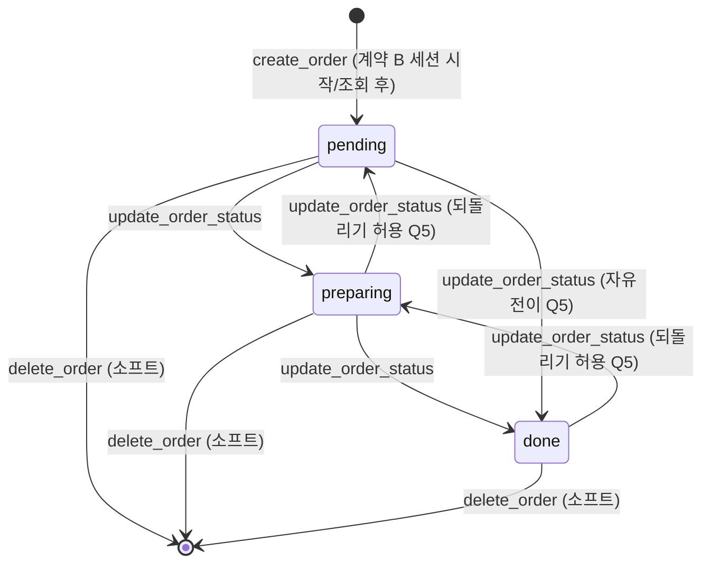
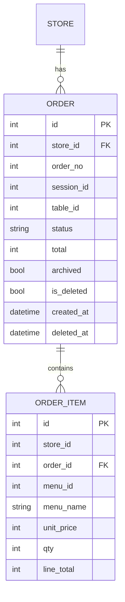

# U3 도메인 엔티티 (Domain Entities) — Order (+ Cart)

U3가 **소유**하는 엔티티는 `Order`, `OrderItem`. 모두 U0의 `Base`를 상속하고 `store_id`로 격리된다(NFR-3). 장바구니(Cart)는 **클라이언트 측 로컬 저장**이므로 서버 엔티티가 없다(US-C3, NFR-5).

세션(`TableSession`)은 U4 소유이며, U3는 계약 B(`start_or_get_active_session`)로 얻은 `session_id`만 참조한다(FK 아님 — 유닛 경계, 정수 참조 컬럼).

---

## Order (주문)
테이블 세션 내 1회 주문. 첫 주문 시 세션이 시작되고(계약 B), 이후 주문은 같은 활성 세션에 연결된다.

| 필드 | 타입 | 제약 | 설명 |
|---|---|---|---|
| id | int | PK, autoincrement | 내부 식별자 |
| store_id | int | not null, index | 소속 매장(격리 키, NFR-3) |
| order_no | int | not null | **매장별 일련번호**(Q1) — 관리자·고객 표시용. `unique(store_id, order_no)` |
| session_id | int | not null, index | 계약 B로 확보한 활성 세션 id(U4 소유, FK 아님) |
| table_id | int | not null, index | 주문 테이블(컨텍스트에서 주입) |
| status | str(enum) | not null, default `"pending"` | 주문 상태: `pending`(대기중) \| `preparing`(준비중) \| `done`(완료) |
| total | int | not null | 주문 총액 = Σ(item.unit_price × qty), 서버 재계산 |
| archived | bool | not null, default false | 계약 C — 세션 종료 시 이력 이관 마킹. `true`면 현재 세션 조회에서 제외 |
| is_deleted | bool | not null, default false | 소프트 삭제(Q2, US-A5) — `true`면 목록·총액·이력 집계에서 제외 |
| created_at | datetime | not null, default now | 주문 시각 |
| deleted_at | datetime \| None | | 소프트 삭제 시각 |

- 제약: `unique(store_id, order_no)`.
- 관계: `items` 1:N `OrderItem`(cascade delete-orphan).
- 상태 라벨 매핑(프론트 표시): `pending`→대기중, `preparing`→준비중, `done`→완료.

## OrderItem (주문 항목)
주문에 포함된 개별 메뉴 라인. **주문 시점 단가·메뉴명 스냅샷**을 저장해 이후 메뉴 변경/삭제에도 주문·이력이 보존된다.

| 필드 | 타입 | 제약 | 설명 |
|---|---|---|---|
| id | int | PK, autoincrement | 내부 식별자 |
| store_id | int | not null, index | 격리 키(NFR-3, BaseRepository 사용 위해 명시) |
| order_id | int | FK→order.id, not null, index | 소속 주문 |
| menu_id | int | not null | 메뉴 참조(U2 소유, FK 아님 — 유닛 경계) |
| menu_name | str | not null | **스냅샷** — 주문 시점 메뉴명(계약 A 응답 복사) |
| unit_price | int | not null | **스냅샷** — 주문 시점 단가(계약 A 응답 복사) |
| qty | int | not null, > 0 | 수량 |
| line_total | int | not null | `unit_price × qty` |

- 관계: `order` N:1 `Order`.
- 단가/메뉴명은 계약 A(`get_menu_items`)의 응답을 복사 저장(BR-U3-3). 클라이언트가 보낸 가격은 신뢰하지 않는다.

---

## 상태 생명주기 (Order.status)

- **자유 전이(Q5)**: 관리자는 세 상태 중 임의 값으로 변경 가능(직권 운영). 유효성은 "세 값 중 하나"만 검증.
- 세션 종료(계약 C)는 상태를 바꾸지 않고 `archived=true`로만 표시(현재 목록에서 제외).

## ER (요약)

> `session_id`·`menu_id`는 타 유닛(U4/U2) 소유 엔티티를 가리키는 **정수 참조**로, DB FK 제약을 걸지 않는다(모놀리식 단일 DB이나 유닛 경계·병렬 개발/모킹 유지). 격리·정합성은 서비스 계층 규칙(BR-U3-*)으로 보장.
