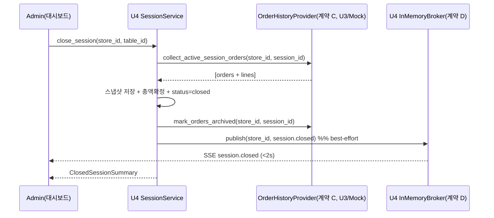

# U4 비즈니스 로직 모델 (Business Logic Model)

기술 중립적 관점의 U4 핵심 로직. 세션 라이프사이클 + 실시간 전파(pub-sub/SSE) + 대시보드/이력 조회. 계약 B(제공)·C(소비)·D(구현)의 상호작용을 정의.

## 1. 세션 라이프사이클

### 1.1 세션 시작/조회 — 계약 B (U4 제공, U3 소비)
- `start_or_get_active_session(store_id, table_id) -> session_id`
  - 해당 테이블의 `active` 세션 조회 → 있으면 그 `session_id` 반환(멱등).
  - 없으면 새 `TableSession(status='active', total_amount=0, started_at=now)` 생성 후 `session_id` 반환.
  - 동시성: 부분 유니크 인덱스(Q1=C)로 중복 생성 방지, 서비스는 트랜잭션 내 조회-후-생성.
- `get_active_session(store_id, table_id) -> session | None`
  - 활성 세션 조회만(없으면 None). U3가 현재 세션 내역(US-C5) 컨텍스트로 사용.
- **store_id는 항상 StoreContext에서(BR-U0-3)**. 계약 B는 서비스 메서드로 U3가 직접 호출(내부 in-process).

### 1.2 세션 종료 + 이력 이관 — US-A6 (관리자)
`close_session(store_id, table_id)` 흐름:
1. 활성 세션 조회. 없으면 종료 대상 없음 처리(Q9: 활성 세션 있을 때만 진행; 없으면 안내).
2. 계약 C `collect_active_session_orders(store_id, session_id)` 호출 → 주문 목록 수집(주문 0건도 정상, Q9=A).
3. 각 주문을 `SessionHistoryOrder` + `SessionHistoryOrderLine`로 **스냅샷 저장**(Q2=A/Q3=A).
4. 세션 `total_amount` 확정(수집 주문 금액 합) → `status='closed'`, `closed_at=now`.
5. 계약 C `mark_orders_archived(store_id, session_id)` 호출 → U3가 활성 주문 목록에서 제외(US-C5 화면 리셋 반영).
6. 계약 D `publish(store_id, session_closed({table_id, session_id, closed_at, total_amount}))` — best-effort.
7. `ClosedSessionSummary`(table_id, session_id, total_amount, closed_at, 주문 수) 반환.
- 트랜잭션 경계: 3~5는 단일 DB 트랜잭션(원자적). 6(발행)은 커밋 후 best-effort(BR-U0-13, 실패해도 종료는 성공).

### 1.3 새 세션 시작
종료 후 동일 테이블에서 U3가 첫 주문을 내면 계약 B가 다시 호출되어 **새 active 세션** 생성(이전 이력은 현재 화면 미표시).

## 2. 대시보드 스냅샷 — US-A2 (관리자)
`get_dashboard(store_id, preview_n=3)` (Q4=A, Q5=A):
- 매장의 `active` 세션 목록 조회(U4 데이터): table_id, session_id, started_at, total_amount.
- 테이블별 **최신 주문 미리보기 n개**(기본 3) + 현재 총액은 계약(U3 조회)로 보강 — 표준 스탠드얼론에선 Mock provider가 제공.
- 반환: 테이블 카드 배열 `[{table_id, table_number, session_id, total_amount, recent_orders:[...]}]`.
- 초기 로드 후 화면은 SSE 이벤트로 라이브 갱신(§3). 재연결 시 이 스냅샷을 재조회해 재동기화(Q7=C).

## 3. 실시간 전파 (pub-sub + SSE) — 계약 D 구현
### 3.1 브로커 (개념)
- 매장별(`store_id`) 구독자 집합. 발행자(U3 주문 이벤트, U4 세션 종료 이벤트)가 `publish(store_id, event)` 호출 시 해당 매장 구독자 전원에게 이벤트 fan-out.
- 이벤트 종류(U0 `events.py`): `order.created/updated/status_changed/deleted`, `session.closed`.
- best-effort: 구독자 없거나 전송 실패해도 발행 호출은 예외 없이 반환(BR-U0-13).

### 3.2 관리자 스트림 — US-A2/A3/A5/A6 반영
- 매장 전체 이벤트 구독. 신규 주문/상태변경/삭제/세션종료를 2초 이내 수신(NFR-1) → 대시보드 라이브 갱신·강조.

### 3.3 고객 스트림 — US-C6 (Q8=A)
- 별도 스트림. 서버가 `StoreContext.table_id`로 **자기 테이블 이벤트만** 필터해 전송(격리 강화).
- 주문 상태 변경(`order.status_changed`) 수신 시 고객 주문 내역 화면(U3 소유)이 새로고침 없이 갱신.

## 4. 과거 이력 조회 — US-A7 (관리자, Q6=A)
`list_history(store_id, table_id?, date_from?, date_to?, page)`:
- `closed` 세션의 `SessionHistoryOrder`(+lines)를 **`closed_at` 역순** 반환.
- 필터: table_id(테이블별), 날짜 구간(기준 = `closed_at`).
- 페이지네이션(U0 `Page[T]`/`PageParams` 재사용). store 격리(NFR-3), 런타임 U3 의존 없음(스냅샷 자립).

## 5. 상호작용 다이어그램

