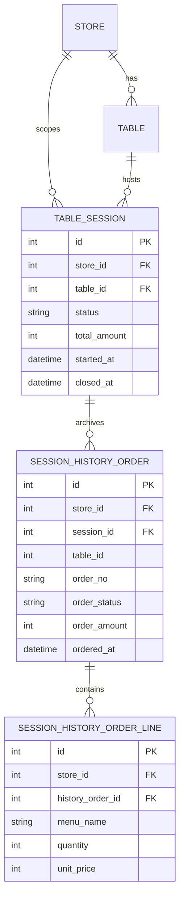

# U4 도메인 엔티티 (Domain Entities)

U4가 **소유**하는 엔티티: `TableSession`, `SessionHistoryOrder`, `SessionHistoryOrderLine`. 모두 U0 `Base`를 상속하고 `store_id`로 격리(NFR-3). U0 `Store`/`Table`, U3 `Order`(런타임 참조 아님 — 종료 시점 스냅샷)와 연관.

## TableSession (테이블 세션)
테이블의 이용 단위(고객 착석~이용 완료). 첫 주문 시 시작(계약 B), 관리자 종료 시 닫힘(US-A6).

| 필드 | 타입 | 제약 | 설명 |
|---|---|---|---|
| id | int | PK, autoincrement | 세션 식별자(= 계약 B의 `session_id`) |
| store_id | int | FK→stores.id, not null, index | 소속 매장(격리 키) |
| table_id | int | FK→tables.id, not null, index | 소속 테이블 |
| status | str | not null, default `'active'` | `'active'` \| `'closed'` |
| total_amount | int | not null, default 0 | 현재 세션 누적 총액(원). 주문 변동 시 U3가 갱신(계약), 종료 시 확정 |
| started_at | datetime | not null, default now | 세션 시작 시각 |
| closed_at | datetime | nullable | 이용 완료 시각(종료 전 null) |

- **제약(Q1=C)**: `unique(store_id, table_id) WHERE status='active'` **부분 유니크 인덱스**(SQLite 지원) + 서비스 레벨 가드(조회 후 없으면 생성, 트랜잭션 내). 테이블당 활성 세션 1개 보장.
- 관계: `store` N:1 `Store`, `table` N:1 `Table`, `history_orders` 1:N `SessionHistoryOrder`(종료 후 채워짐).
- `session_id`는 U3 주문과 연결되는 키(주문은 U3 소유, `session_id` FK 보유 — 계약).

## SessionHistoryOrder (이력 주문 스냅샷) — Q2=A, Q3=A
세션 종료 시 계약 C(`collect_active_session_orders`)로 수집한 주문을 **자립 스냅샷**으로 저장. US-A7 조회가 런타임에 U3에 의존하지 않도록 한다.

| 필드 | 타입 | 제약 | 설명 |
|---|---|---|---|
| id | int | PK, autoincrement | |
| store_id | int | FK→stores.id, not null, index | 격리 키 |
| session_id | int | FK→table_sessions.id, not null, index | 소속(종료된) 세션 |
| table_id | int | not null, index | 조회 편의를 위한 비정규화 |
| order_no | str | not null | 원 주문 번호(U3 발번) |
| order_status | str | not null | 종료 시점 주문 상태(대기중/준비중/완료) |
| order_amount | int | not null | 주문 금액(원) |
| ordered_at | datetime | not null | 주문 시각 |

- 관계: `session` N:1 `TableSession`, `lines` 1:N `SessionHistoryOrderLine`.

## SessionHistoryOrderLine (이력 주문 메뉴 라인 스냅샷) — Q3=A
주문별 메뉴 라인 스냅샷(정산·상세 확인 지원).

| 필드 | 타입 | 제약 | 설명 |
|---|---|---|---|
| id | int | PK, autoincrement | |
| store_id | int | FK→stores.id, not null, index | 격리 키 |
| history_order_id | int | FK→session_history_orders.id, not null, index | 소속 이력 주문 |
| menu_name | str | not null | 메뉴명(스냅샷 — 이후 메뉴 변경/삭제와 무관) |
| quantity | int | not null | 수량 |
| unit_price | int | not null | 단가(원, 주문 시점) |

## ER (요약)



## 계약 C 소비 데이터 형태 (U3 → U4, 종료 시점)
`collect_active_session_orders(store_id, session_id) -> [Order]`가 반환하는 각 주문(U4가 스냅샷으로 변환):
```
{ order_no, order_status, order_amount, ordered_at,
  lines: [{ menu_name, quantity, unit_price }] }
```
- U4는 위 형태를 프로토콜로 고정하고, 표준 스탠드얼론 개발에선 Mock provider가 이 형태를 반환.
