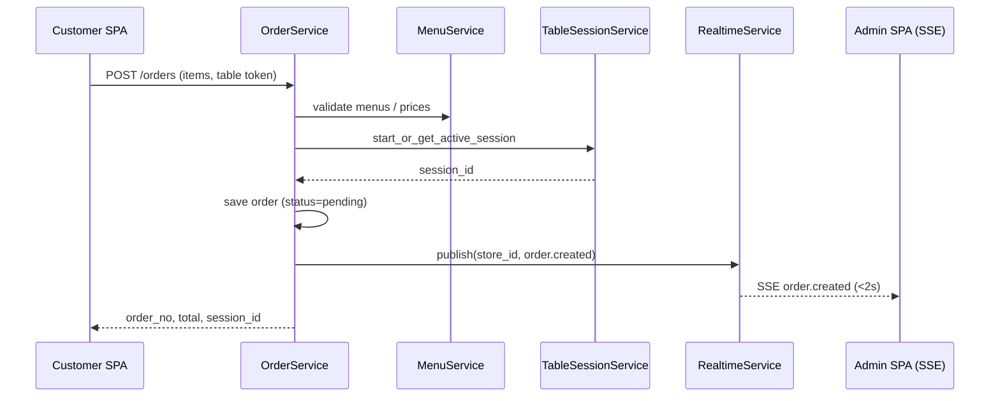
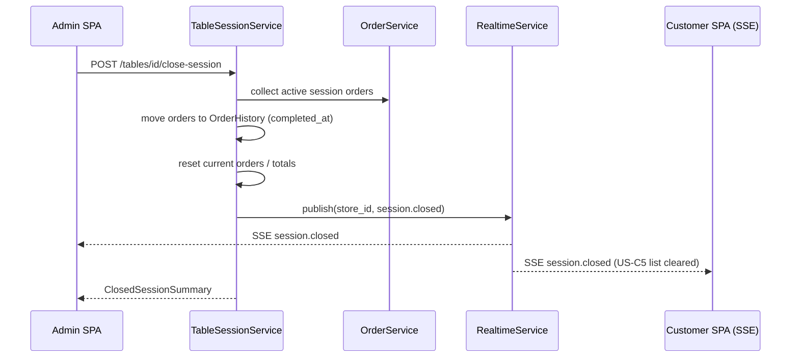
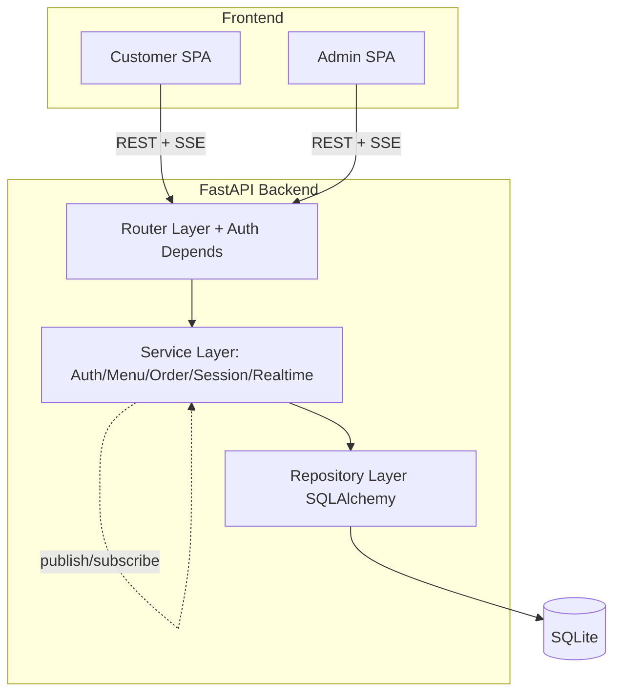

# 컴포넌트 의존 관계 (Component Dependency)

컴포넌트 간 의존성, 통신 패턴, 데이터 흐름을 정의한다.

---

## 의존성 매트릭스

행(row)이 열(column)에 **의존한다**(호출한다)는 의미. `-`는 의존 없음.

| ↓ 의존 \ 대상 → | Platform | Auth | Menu | Order | TableSession | Realtime |
|---|---|---|---|---|---|---|
| **Platform** | - | - | - | - | - | - |
| **Auth** | ✓ | - | - | - | - | - |
| **Menu** | ✓ | (컨텍스트) | - | - | - | - |
| **Order** | ✓ | (컨텍스트) | ✓ | ✓ | - | ✓(publish) |
| **TableSession** | ✓ | (컨텍스트) | - | ✓(이관) | - | ✓(publish) |
| **Realtime** | ✓ | (컨텍스트) | - | ✓(스냅샷) | - | - |
| **Customer SPA** | - | ✓ | ✓ | ✓ | - | ✓(SSE) |
| **Admin SPA** | ✓(테이블) | ✓ | ✓ | ✓ | ✓ | ✓(SSE) |

- `(컨텍스트)`: 라우터 의존성으로 주입되는 `StoreContext` 검증에 Auth를 사용(직접 서비스 호출 아님).
- **Order ↔ TableSession**: 주문 생성 시 세션 시작(Order→Session), 세션 종료 시 주문 이관(Session→Order) — 제한적 상호 협력. 순환 결합 최소화는 Functional Design에서 인터페이스로 정리.

---

## 통신 패턴

| 패턴 | 사용처 | 방식 |
|---|---|---|
| REST(동기 요청/응답) | 프론트엔드 ↔ 백엔드 대부분 | HTTPS + JSON |
| 서비스 간 직접 호출(동기) | Order↔Menu, Order↔TableSession (Q8-A) | 프로세스 내 함수 호출 |
| Pub-Sub(인메모리) | 도메인 서비스 → Realtime (Q2-A) | `publish(store_id, event)` |
| SSE(서버→클라이언트 단방향 스트림) | Realtime → 관리자/고객 SPA | text/event-stream |
| 인증 컨텍스트 주입 | 모든 라우터 (Q5-A) | FastAPI Depends → StoreContext |

---

## 데이터 흐름 다이어그램

### 주문 생성 → 실시간 전파 (S1)

### 세션 종료(이용 완료) → 이력 이관 (S4)

### 계층 구조 (백엔드 3계층)

---

## 격리 및 병렬 개발 관점
- **멀티테넌시 격리**: 모든 데이터 흐름은 `store_id` 컨텍스트를 통과하며 리포지토리에서 강제(NFR-3). 매장 간 데이터 노출 없음.
- **병렬 개발 결합도**: Platform/Common을 안정된 계약(BaseRepository, StoreContext, Store/Table)으로 먼저 확정하면, Auth/Menu/Order/Session 유닛을 독립적으로 병렬 개발 가능. Realtime은 `publish(store_id, event)` 단일 인터페이스로 결합도를 낮춰 다른 유닛이 이벤트 스키마만 공유하면 됨.
- **계약 우선(Contract-first)**: 유닛 간 결합 지점(Menu 조회, Session 시작/조회, Realtime publish, 이벤트 스키마)은 Units Generation/Functional Design에서 인터페이스를 먼저 고정.
