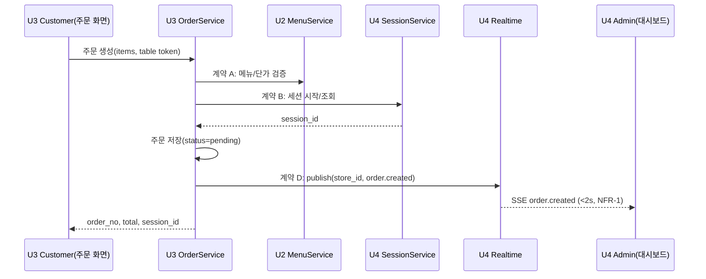
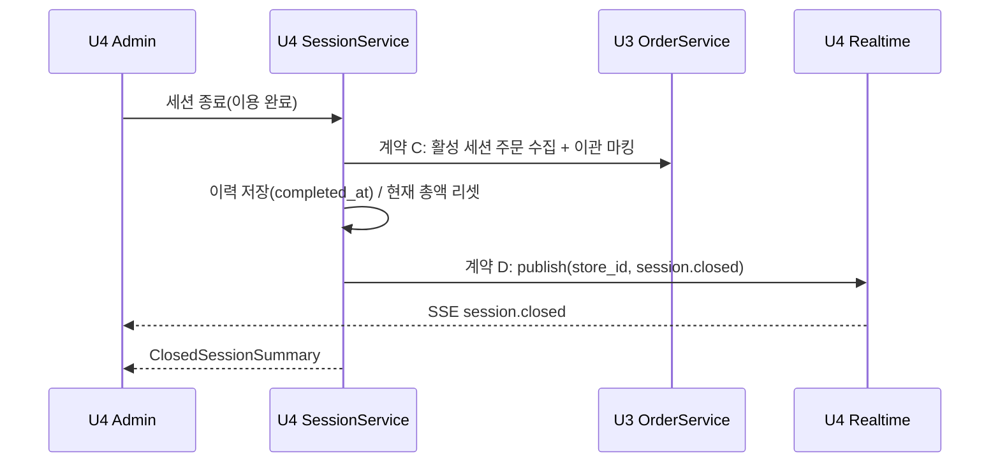
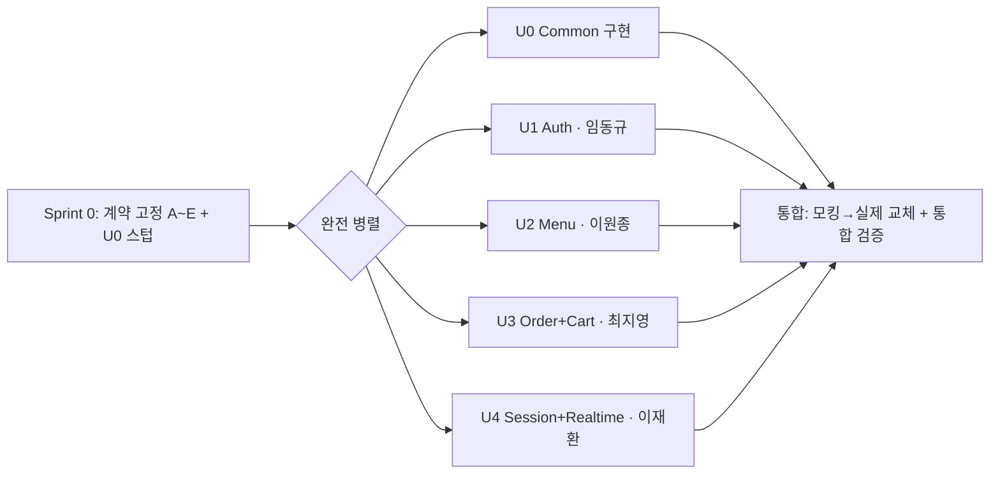

# 유닛 의존 관계 (Unit of Work Dependency)

유닛 간 의존성, 계약 지점(Contract-first), 개발 순서를 정의한다. 결합 지점은 Sprint 0에서 인터페이스·스키마로 고정한 뒤 병렬 개발한다(Q3-B, Q4-F, Q6-B).

## 의존성 매트릭스

행(row)이 열(column)에 **의존한다**(호출/사용)는 의미. `-`는 의존 없음.

| ↓ 의존 \ 대상 → | U0 Common | U1 Auth | U2 Menu | U3 Order | U4 Session+Realtime |
|---|---|---|---|---|---|
| **U0 Common** | - | - | - | - | - |
| **U1 Auth** | ✓ | - | - | - | - |
| **U2 Menu** | ✓ | (컨텍스트) | - | - | - |
| **U3 Order** | ✓ | (컨텍스트) | ✓ (조회 A) | - | ✓ (세션 B, publish D) |
| **U4 Session+Realtime** | ✓ | (컨텍스트) | - | ✓ (이력 이관 C) | - |

- `(컨텍스트)`: 라우터 의존성으로 주입되는 `StoreContext` 검증에 Auth 토큰을 사용(직접 서비스 호출 아님, 계약 E).
- **U3 ↔ U4 상호 협력**: 주문 생성 시 세션 시작(U3→U4, 계약 B), 세션 종료 시 주문 이력 수집(U4→U3, 계약 C). 계약을 인터페이스로 고정해 순환 결합 최소화.

## 계약 지점 (Q4-F: 전부 고정)

Sprint 0에서 아래 계약을 동결한다. 소비 유닛은 계약에 대한 모킹으로 병렬 개발.

| 계약 | 방향 | 인터페이스(개략) | 소유(제공) |
|---|---|---|---|
| **A. Menu 조회** | U3 → U2 | `get_menu_items(store_id, menu_ids) -> [{id, name, price, available}]` (단가·유효성) | U2 Menu |
| **B. Session 시작/조회** | U3 → U4 | `start_or_get_active_session(store_id, table_id) -> session_id`, `get_active_session(store_id, table_id)` | U4 Session |
| **C. 이력 이관** | U4 → U3 | `collect_active_session_orders(store_id, session_id) -> [orders]`, `mark_orders_archived(...)` | U3 Order |
| **D. Realtime publish + 이벤트 스키마** | U3, U4 → U4 | `publish(store_id, event)`; event ∈ {`order.created`, `order.updated`, `order.deleted`, `order.status_changed`, `session.closed`} (스키마는 U0 `common/events`에 정의) | U4 Realtime (스키마: U0) |
| **E. StoreContext** | 전 유닛 → U0 | `Depends(get_current_store_context) -> StoreContext{store_id, subject, table_id?}` | U0 Common |

> 이벤트 스키마 정의는 U0(`common/events`)에 두어 발행자(U3/U4)와 구독자(SSE)가 공유. 실시간 전파는 U4 Realtime 전담.

## 데이터 흐름 (유닛 관점)

### 주문 생성 → 실시간 전파

### 세션 종료 → 이력 이관

## 개발 순서 (Q6-B)

- **Sprint 0(선행, 공동)**: 계약 A~E 동결 + U0 인터페이스 스텁.
- **병렬(완전 동시)**: U0 구현과 U1~U4 동시 착수. 의존 유닛은 고정 계약 모킹으로 독립 진행.
- **통합**: 모킹을 실제 구현으로 교체, U3↔U4·U3↔U2 통합 지점 검증.

## 검증
- ✅ 순환 의존(U3↔U4)을 계약 B/C로 방향 분리, 모킹으로 병렬 가능.
- ✅ 모든 결합 지점(A~E)이 계약으로 고정됨(Q4-F).
- ✅ U0가 유일한 무의존 기반, 나머지 유닛은 U0 + 명시적 계약에만 의존.
