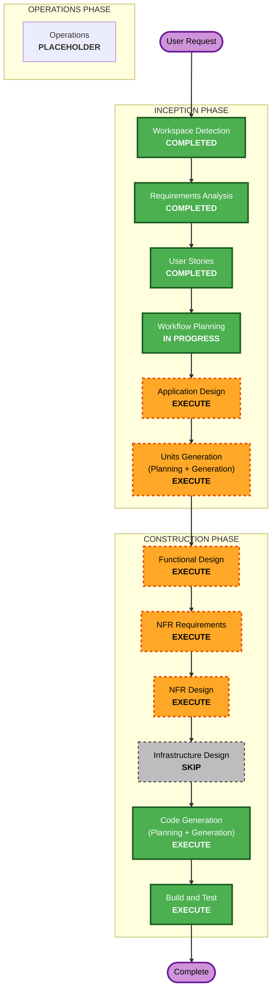

# Execution Plan — 테이블오더 서비스

> 출처: `requirements/requirements.md`, `user-stories/stories.md`, `user-stories/personas.md`
> 프로젝트 유형: **Greenfield** / 실행 대상: **로컬 개발(워크숍/데모)**

## Detailed Analysis Summary

### Change Impact Assessment
- **User-facing changes**: Yes — 고객용 Vue SPA(태블릿) + 관리자용 Vue SPA 신규 구축.
- **Structural changes**: Yes — 신규 시스템 전체(FastAPI 백엔드 + 2개 프론트엔드 + SQLite) 아키텍처 정의.
- **Data model changes**: Yes — 매장/계정/메뉴/테이블/세션/주문/주문이력 신규 스키마.
- **API changes**: Yes — 고객·관리자 REST API + SSE 스트리밍 엔드포인트 신규.
- **NFR impact**: Yes — SSE 실시간(2초), 멀티테넌시(매장 격리), JWT/bcrypt 인증, 클라이언트 영속(장바구니/자동로그인), 터치 UI.

### Risk Assessment
- **Risk Level**: Medium — 신규 그린필드이나 실시간 SSE + 세션 라이프사이클 도메인 로직이 복잡도 요인. 실행은 로컬이라 배포 리스크는 낮음.
- **Rollback Complexity**: Easy — 로컬/신규 코드, 프로덕션 의존 없음.
- **Testing Complexity**: Moderate — 세션 종료/이력 이관, SSE 실시간 전파, 멀티테넌시 격리에 대한 통합 테스트 필요.

### 병렬 개발 구성 (핵심 제약)
- 개발 인원: **4명 — 임동규 · 이원종 · 최지영 · 이재환**
- 방식: **유닛(Unit)별 병렬 개발**. 유닛 경계는 에픽/도메인(인증 · 메뉴 · 주문/장바구니 · 실시간 모니터링/세션)을 기준으로 **Units Generation** 단계에서 확정한다.
- 목표: 유닛 간 의존을 최소화하고 인터페이스(공유 데이터 모델·API 계약)를 조기 고정해 4인 동시 작업이 가능하도록 분해.

## Workflow Visualization

## Phases to Execute

### 🔵 INCEPTION PHASE
- [x] Workspace Detection (COMPLETED)
- [x] Reverse Engineering (SKIPPED — Greenfield)
- [x] Requirements Analysis (COMPLETED)
- [x] User Stories (COMPLETED)
- [x] Workflow Planning / Execution Plan (IN PROGRESS)
- [ ] Application Design — **EXECUTE**
  - **Rationale**: 신규 시스템으로 컴포넌트·서비스 경계, 도메인 모델, 서비스 메서드/비즈니스 규칙(세션 라이프사이클 등), 컴포넌트 간 의존을 정의해야 함. Units 분해의 입력이 됨.
- [ ] Units Generation — **EXECUTE**
  - **Rationale**: 시스템을 다중 유닛으로 분해 필요. **4인(임동규·이원종·최지영·이재환) 병렬 개발**을 위해 인증/메뉴/주문·장바구니/실시간·세션 도메인을 독립 유닛으로 나누고 유닛 간 인터페이스(공유 모델·API 계약)를 고정.

### 🟢 CONSTRUCTION PHASE (유닛별 반복 루프)
- [ ] Functional Design — **EXECUTE** (per-unit)
  - **Rationale**: 신규 데이터 모델/스키마와 복잡한 비즈니스 로직(테이블 세션 시작·종료, 주문 이력 이관, 총액 재계산)의 상세 설계 필요.
- [ ] NFR Requirements — **EXECUTE** (per-unit)
  - **Rationale**: 기술 스택은 확정됐으나 SSE 실시간(2초, NFR-1), 멀티테넌시 격리(NFR-3), 인증/세션(NFR-2), 클라이언트 영속(NFR-5), 터치 UI(NFR-6)에 대한 유닛별 NFR 정리 필요. (얕은 깊이로 진행)
- [ ] NFR Design — **EXECUTE** (per-unit)
  - **Rationale**: 위 NFR을 구현 패턴(SSE 브로드캐스트, JWT 미들웨어, store_id 스코핑, localStorage 영속)으로 반영.
- [ ] Infrastructure Design — **SKIP**
  - **Rationale**: 실행 대상이 로컬 개발 환경이며 클라우드 리소스/배포 아키텍처가 범위 밖(요구사항 §2, NFR-7). 실행 스크립트 수준 안내는 Build and Test에서 다룸.
- [ ] Code Generation — **EXECUTE (ALWAYS)** (per-unit)
  - **Rationale**: 각 유닛의 구현 계획 및 코드/테스트 생성.
- [ ] Build and Test — **EXECUTE (ALWAYS)**
  - **Rationale**: 전체 유닛 빌드·단위/통합 테스트(세션 이관, SSE 전파, 멀티테넌시 격리) 및 로컬 실행 지침.

### 🟡 OPERATIONS PHASE
- [ ] Operations — **PLACEHOLDER** — 향후 배포/모니터링 워크플로우.

## Estimated Timeline
- **Total Stages to Execute**: 8 (INCEPTION 2 + CONSTRUCTION 6, Infrastructure Design 제외)
- **Estimated Duration**: 워크숍 규모 기준 개략 — 유닛 4개 병렬 시 CONSTRUCTION 루프가 실질 소요의 대부분.

## Success Criteria
- **Primary Goal**: 멀티테넌트 테이블오더 MVP(고객 SPA + 관리자 SPA + FastAPI + SQLite)를 로컬에서 동작하도록 구현.
- **Key Deliverables**: Application Design → 병렬 개발 가능한 유닛 정의 → 유닛별 설계/코드 → 통합 빌드·테스트.
- **Quality Gates**: 14개 사용자 스토리 인수 조건(Gherkin) 충족, 멀티테넌시 격리, SSE 2초 이내 반영, 세션 종료/이력 이관 정확성.
